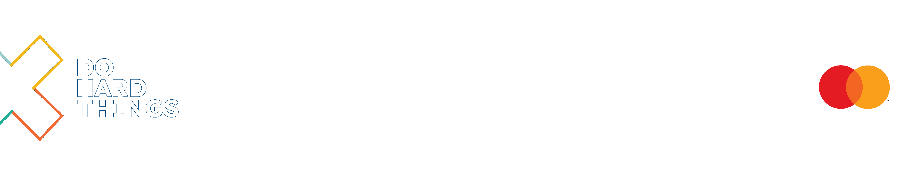

 
<h1 align="center">Python - Web framework - 1</h1>
 

## ALX_Learner

<h4 align="center">SOUFIANE AKHAIT</h4>

<h5 align="center">:arrow_down:  <i>You can find me here</i>  :arrow_down:</h5>
 

  
  <space>     </space>
  <space>     </space> 

 

  
  <space>     </space>

---

**Happy Coding! 😊**